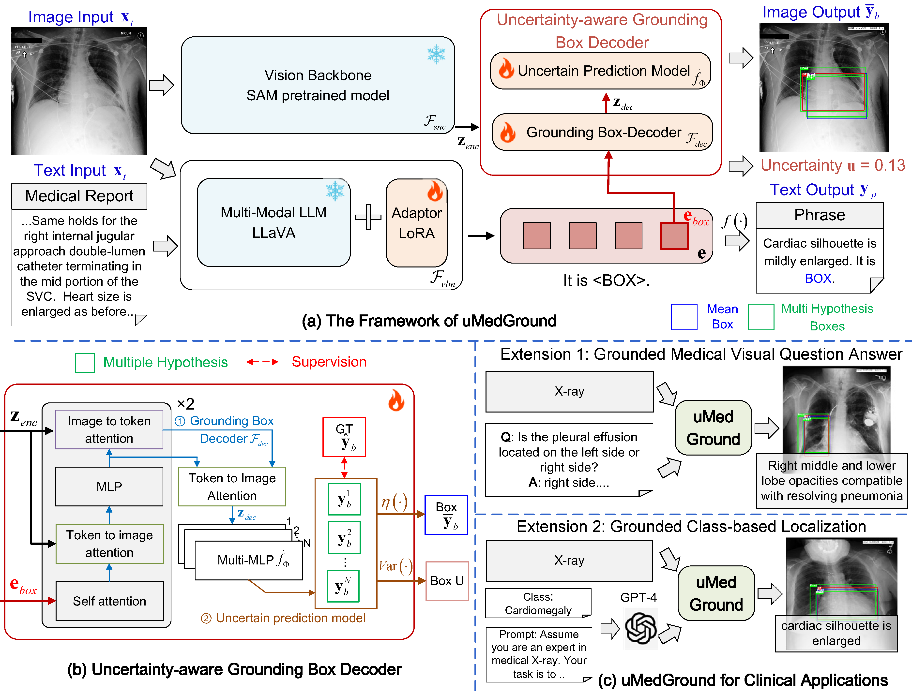
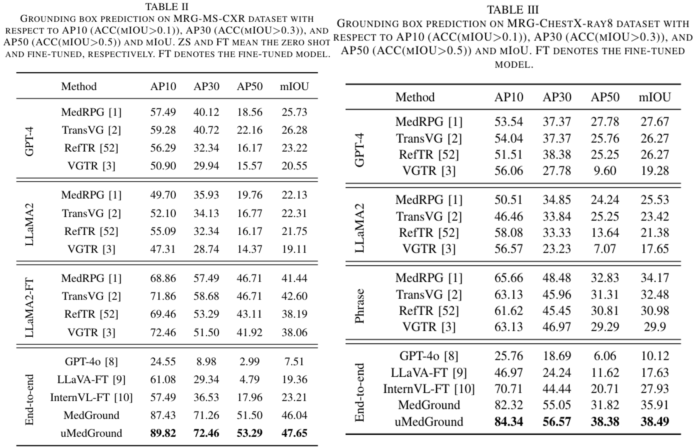
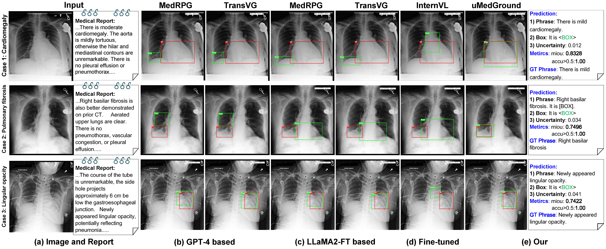
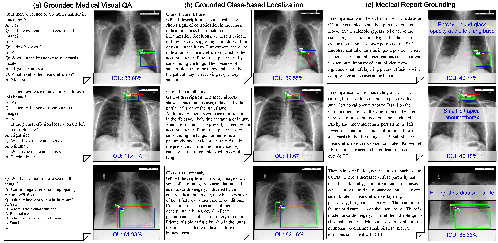

# uMedGround
* This repository provides the code for our accepted TPAMI 2025 paper "Uncertainty-aware Medical Diagnostic Phrase Identifying and Grounding" 
* Current Pre-implementation of **uMedGround** [arxiv](https://arxiv.org/abs/2404.06798) / [IEEE](https://ieeexplore.ieee.org/abstract/document/11119420)

##  :fire: NEWS :fire:
* [2025/09/14] We have released all codes for uMedGround. Curated Datasets are coming soon.
* [2025/08/13] We launched the Grounding-VLM research group 🌐. If you are interested in Grounding-VLM, please email [me](kezou8@gmail.com) to join the Grounding-VLM research group.
* [2025/08/06] We will release all codes and datasets as soon as possible.
* [2025/08/06] Our camera-ready paper was released first on the [arixv](https://arxiv.org/abs/2404.06798). 
* [2025/08/04] Our paper was accepted by IEEE TPAMI 2025, thanks all my collobrators. 
* [2025/06/26] Our related paer accepted by **ICCV 2025**: "GEMeX: A Large-Scale, Groundable, and Explainable Medical VQA Benchmark for Chest X-ray Diagnosis"[[Paper]](https://arxiv.org/abs/2411.16778)[[Link]](https://www.med-vqa.com/GEMeX/), Congrats to Bo ! !
* [2024/12/02] Our paper submitted to IEEE TPAMI. 


## Introduction
Medical phrase grounding is crucial for identifying relevant regions in medical images based on phrase queries, facilitating accurate image analysis and diagnosis. However, current methods rely on manual extraction of key phrases from medical reports, reducing efficiency and increasing the workload for clinicians.  Additionally, the lack of model confidence estimation limits clinical trust and usability. In this paper, we introduce a novel task—Medical Report Grounding (MRG)—which aims to directly identify diagnostic phrases and their corresponding grounding boxes from medical reports in an end-to-end manner. To address this challenge, we propose uMedGround, a reliable framework that leverages a multimodal large language model (LLM) to predict diagnostic phrases by embedding a unique token, BOX, into the vocabulary to enhance detection capabilities. The embedded token, together with the input medical image, is decoded by a vision encoder-decoder to generate the corresponding grounding box. Critically, uMedGround incorporates an uncertainty-aware prediction model, significantly improving the robustness and reliability of grounding predictions. Experimental results demonstrate that uMedGround outperforms state-of-the-art medical phrase grounding methods and fine-tuned large visual-language models, validating its effectiveness and reliability. This study represents a pioneering exploration of the MRG task, marking the first-ever endeavor in this domain. Additionally, we explore the potential of uMedGround in grounded medical visual question answering and class-based localization applications.

<p align="center">  </p>

## Highlights
**uMedGround** unlocks the medical report grounding, which aims to directly identify diagnostic phrases and their corresponding grounding boxes from medical reports in an end-to-end manner: 
1. End-to-end medical report phrase grounding; 
2. Multimodal framework with box token embedding; 
3. Uncertainty-aware grounding prediction model; 
4. Generalization to VQA and localization tasks.

## Requirment
```pip install requirements.txt```
- torch==1.13.1
- torchvision==0.14.1
- packaging
- sentencepiece
- peft==0.4.0
- einops==0.4.1
- ...

## Public Datasets
* [MIMIC-CXR dataset](https://physionet.org/content/mimic-cxr/2.0.0/)
* [ChestX-ray8 dataset](https://ar5iv.labs.arxiv.org/html/1705.02315)
* [Medical-Diff-VQA dataset](https://physionet.org/content/medical-diff-vqa/1.0.0/)

## Curated Datasets
If the paper goes to substantive review, we promise to disclose all the datasets.

* [MRG-MS-CXR dataset]
* [MRG-ChestX-ray8 dataset]
* [MRG-MIMIC-VQA]
* [MRG-MIMIC-Class dataset]

## Code Usage
### 1. Download the pretrained weights
- See the script ```./pretrained/readme.txt```
#### LLaVA
To train LISA-7B or 13B, you need to follow the [instruction](https://github.com/haotian-liu/LLaVA/blob/main/docs/MODEL_ZOO.md) to merge the LLaVA delta weights. Typically, we use the final weights `LLaVA-Lightning-7B-v1-1` and `LLaVA-13B-v1-1` merged from `liuhaotian/LLaVA-Lightning-7B-delta-v1-1` and `liuhaotian/LLaVA-13b-delta-v1-1`, respectively. For Llama2, we can directly use the LLaVA full weights `liuhaotian/llava-llama-2-13b-chat-lightning-preview`.
#### SAM ViT-H weights
Download SAM ViT-H pre-trained weights from the [link](https://dl.fbaipublicfiles.com/segment_anything/sam_vit_h_4b8939.pth).
#### MedSAM_vit_b weights
Download SAM ViT-H pre-trained weights from the [link](https://drive.google.com/drive/folders/1ETWmi4AiniJeWOt6HAsYgTjYv_fkgzoN).

### 2. Download the Curated Datasets from the above links, and organize them as follows.
- See the script ```In_data/readme.txt```


```
├── ./ln_data/reason_gro/MS_CXR
│   ├── files
│   │   ├── p10
│   │       └── xxx.png
│   │   ├── p11
│   │       └── xxx.png
│   │   ├── ...
│   ├── X-ray14
│   │   ├── resize_images
│   │       └── xxx.png
│   │       └── xxx.png
│   │       └── ....png
```

### 3. Train
- Run the script ```python train.py```
```
deepspeed --master_port=24999 train.py \
  --version="PATH_TO_LLaVA" \
  --dataset_dir='./data' \
  --vision_pretrained="PATH_TO_SAM" \
  --dataset="vqa||reason_gro" \
  --sample_rates="9,3,3,1" \
  --exp_name="uMedGround-7b"
   --mhp_box_head \# MedGround
   --Umhp_box_head \# uMedGround
```
When training is finished, to get the full model weight:
```
cd ./runs/uMedGround-7b/ckpt_model && python zero_to_fp32.py . ../pytorch_model.bin
```

### Merge LoRA Weight
Merge the LoRA weights of `pytorch_model.bin`, save the resulting model into your desired path in the Hugging Face format:
```
CUDA_VISIBLE_DEVICES="" python merge_lora_weights_and_save_hf_model.py \
  --version="PATH_TO_LLaVA" \
  --weight="PATH_TO_pytorch_model.bin" \
  --save_path="PATH_TO_SAVED_MODEL"
```

### 4. Test
- Run the script ```python test.py```

## Results
<p align="center">  </p>

## Visualizations
<p align="center">  </p>

## Applications
<p align="center">  </p>

## Citation
If you find uMedGround helps your research, please cite our paper:
```
@InProceedings{uMedGround_Zou_2024,
author="Zou, Ke
and Bai, Yang
and Bo, Liu
and Yidi, Chen,
and Chen, Zhihao
and Chen, Yidi
and Yuan, Xuedong
and Wang, Meng
and Shen, Xiaojing
and Xiaochun Cao
and Yih Chung Tham
and Fu, Huazhu",
title="MedRG: Medical Report Grounding with Multi-modal Large Language Model",
journal={arXiv preprint arXiv:2404.06798},
year={2024}
}
```

## Acknowledgement
-  This work is built upon the  [LISA](https://github.com/dvlab-research/LISA)

## Contact
* If you have any problems about our work, please contact [me](kezou8@gmail.com) 
* Project Link: [UMedGround](https://github.com/Cocofeat/UMedGround/)
